**Autor**: 
Matheus Jericó Palhares <br>
**LinkedIn**:
https://www.linkedin.com/in/matheusjerico

# Dataset: Bank Marketing

**Fonte oficial do dataset :** https://archive.ics.uci.edu/ml/datasets/bank+marketing

**Dados:** https://archive.ics.uci.edu/ml/machine-learning-databases/00222/bank.zip

Arquivos incluídos no link acima:

- **bank.csv:** uma versão reduzida do conjunto de dados; <br>
- **bank-full.csv:** o conjunto completo; <br>
- **bank-names.txt:** com a descrição dos campos do conjunto de dados.

Para a resolução deste teste utilize o arquivo **bank-full.csv** e para uma descrição sobre
o *dataset* use **bank-names.txt** e/ou a fonte oficial.


#### O que é um *Term Deposit* (depósito a prazo)?

Um depósito a prazo é um produto bancário que pressupõe a entrega de fundos a uma instituição de crédito, que fica obrigada a restituir esses fundos no final de um período de tempo acordado e ao pagamento de uma remuneração, designada de juro. (https://www.todoscontam.pt/pt-pt/depositos-prazo)

#### Para balancear os dados:
https://kite.com/blog/python/smote-python-imbalanced-learn-for-oversampling/

## Questões
1. **Qual profissão tem mais tendência a fazer um empréstimo? De qual tipo?**<br>
2. **Fazendo uma relação entre número de contatos e sucesso da campanha quais são os pontos relevantes a serem observados?**
3. **Baseando-se nos resultados de adesão desta campanha qual o número médio e o máximo de ligações que você indica para otimizar a adesão?**
4. **O resultado da campanha anterior tem relevância na campanha atual?**
5. **Qual o fator determinante para que o banco exija um seguro de crédito?**
6. **Quais são as características mais proeminentes de um cliente que possua empréstimo imobiliário?**

## Descrição dos dados

#### Dados dos clientes: 
1. **age**: idade do cliente (numérico);
2. **job**: tipo de trabalho (categórico: "admin.", "unknown", "unemployed", "management", "housemaid", "entrepreneur", "student", "blue-collar", "self-employed", "retired", "technician", "services");
3. **marital**: estado civil (categórico: "married", "divorced", "single"; note: "divorced" means divorced or widowed);
4. **education**: nível de educação (categórico: "unknown","secondary","primary","tertiary");
5. **default**: tem crédito por padrão (binário: 'no','yes');
6. **balance**: saldo médio anual, em euros (numérico);
7. **housing**: empréstimo para comprar casa (binário: "yes","no");
8. **loan**: empréstimo para uso pessoal (binário: "yes","no");

#### Dados relacionados ao último contato da campanha atual: 
9. **contact**: tipo de comunicação utilizado para contato (categórico: "unknown", "telephone", "cellular"); 
10. **day**: último dia de contato do mês (numérico);
11. **month**: último mês de contato do ano (categórico: "jan", "feb", "mar", ..., "nov", "dec")
12. **duration**: duração do último contato, em segundos (numérico);

#### Outros dados: 
13. **campaign**: número de contatos realizados durante esta campanha e para este cliente (numérico, incluindo últimos contatos);
14. **pdays**: número de dias que passaram após o último contato do cliente de uma campanha anterior (numérico, -1 significa que o cliente não foi contatado anteriormente);
15. **previous**: número de contatos realizados antes desta campanha e para este cliente (numérico);
16. **poutcome**: resultado da campanha de marketing anterior (categórico: "unknown", "other", "failure", "success");

#### Variável de saída: 
17. **y**: o cliente assinou um term deposit (depósito a prazo)? (binário: "yes", "no")


## Bibliotecas utilizadas:
- Pandas (https://pandas.pydata.org/);
- NumPy (https://numpy.org/);
- Seaborn (https://seaborn.pydata.org/);
- Matplotlib (https://matplotlib.org/);
- SciPy (https://www.scipy.org/);
- Scikit-learn (https://scikit-learn.org/stable/);
- XGBoost (https://xgboost.readthedocs.io/en/latest/);
- Imbalanced-learn (https://imbalanced-learn.readthedocs.io/en/stable/api.html);
- Warnings (https://docs.python.org/3/library/warnings.html).
---
---
# Questões

## 1. **Qual profissão tem mais tendência a fazer um empréstimo? De qual tipo?**<br>


```python
le = LabelEncoder()
dataset['y'] = le.fit_transform(dataset['y'])
le_mapping = dict(zip(le.classes_, le.transform(le.classes_)))
print("Mapeamento de classes: {}".format(le_mapping))
```

    Mapeamento de classes: {'no': 0, 'yes': 1}


```python
sns.barplot(dataset['y'], dataset['job'])
plt.show()
```


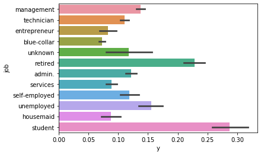


#### Resposta
As profissões que apresentam maior potencial em assinar um depósito à prazo são os Aposentados (***retired***) e os Estudantes (***student***). Situação que faz bastante sentido, tendo em vista que os estudantes buscam estabilidade no futuro, obtendo lucro com o juros do depósito à prazo e guardando dinheiro para o um momento posterior. Já os aposentados tendem a não gastar muito seu dinheiro, dessa forma, podendo aplicar seu dinheiro e  e lucrar com a taxa de juros, conseguem aumentar sua receita.

## 2. **Fazendo uma relação entre número de contatos e sucesso da campanha quais são os pontos relevantes a serem observados?**


```python
df_camp = pd.DataFrame()
```


```python
dataset['y'] = le.inverse_transform(dataset['y'])
df_camp = pd.DataFrame()
df_camp['campaign_nao'] = (dataset[dataset['y'] == 'no'][['y','campaign']].describe())['campaign']
df_camp['campaign_sim'] = (dataset[dataset['y'] == 'yes'][['y','campaign']].describe())['campaign']

df_camp
```


<div>
<table border="1" class="dataframe">
  <thead>
    <tr style="text-align: right;">
      <th></th>
      <th>campaign_nao</th>
      <th>campaign_sim</th>
    </tr>
  </thead>
  <tbody>
    <tr>
      <td>count</td>
      <td>39922.000000</td>
      <td>5289.000000</td>
    </tr>
    <tr>
      <td>mean</td>
      <td>2.846350</td>
      <td>2.141047</td>
    </tr>
    <tr>
      <td>std</td>
      <td>3.212767</td>
      <td>1.921826</td>
    </tr>
    <tr>
      <td>min</td>
      <td>1.000000</td>
      <td>1.000000</td>
    </tr>
    <tr>
      <td>25%</td>
      <td>1.000000</td>
      <td>1.000000</td>
    </tr>
    <tr>
      <td>50%</td>
      <td>2.000000</td>
      <td>2.000000</td>
    </tr>
    <tr>
      <td>75%</td>
      <td>3.000000</td>
      <td>3.000000</td>
    </tr>
    <tr>
      <td>max</td>
      <td>63.000000</td>
      <td>32.000000</td>
    </tr>
  </tbody>
</table>
</div>


```python
df_camp.drop(['count', '25%', '50%', '75%']).plot.bar(title = 'Campaign and TermDeposit statistics')
```


    <matplotlib.axes._subplots.AxesSubplot at 0x7f2e34a5ba50>


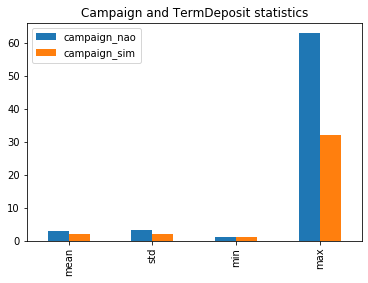


```python
le_mapping = dict(zip(le.classes_, le.transform(le.classes_)))
print("Mapeamento de classes: {}".format(le_mapping))
sns.barplot(dataset['y'], dataset['campaign'])
plt.show()
```

    Mapeamento de classes: {'no': 0, 'yes': 1}


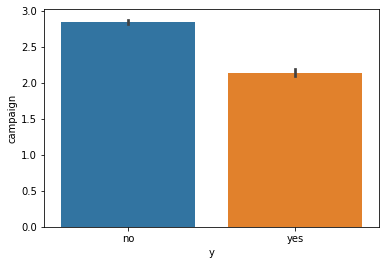


#### Resposta
Os pontos relevantes a serem observados durante a campanha, é que os clientes que receberem uma grande quantidade de contatos recusaram a proposta de assinar um contrato à prazo, e que para conquistar o cliente com o objetivo do mesmo assinar um contrato à prazo é de em média 3 contatos. De acordo com a análise realizada, quando aumenta-se a quantidade de contatos, o cliente não assinará o contrato à prazo.

## 3. **Baseando-se nos resultados de adesão desta campanha qual o número médio e o máximo de ligações que você indica para otimizar a adesão?**
#### Resposta
Média de 2 contatos e no máximo até 4 contatos. Não exceder de 4 contatos, para não gastar tempo, esforço e dinheiro com um cliente que possivelmente não assinará um contrato à prazo.

## 4. **O resultado da campanha anterior tem relevância na campanha atual?**


```python
le = LabelEncoder()
dataset['y'] = le.fit_transform(dataset['y'])
le_mapping = dict(zip(le.classes_, le.transform(le.classes_)))
print("Mapeamento de classes: {}".format(le_mapping))
sns.barplot(dataset['y'], dataset['poutcome'])
plt.show()
```

    Mapeamento de classes: {'no': 0, 'yes': 1}


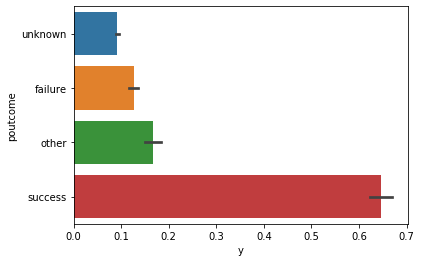


```python
dataset_poutcome_success = dataset[dataset['poutcome'] == 'success']
sns.countplot(dataset_poutcome_success['y'])
```


    <matplotlib.axes._subplots.AxesSubplot at 0x7f2e348afe50>


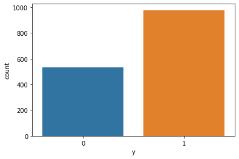


```python
dataset_poutcome_success_grafico = dataset_poutcome_success.describe()['y']
dataset_poutcome_success_grafico['mean']
```


    0.6472534745201853


#### Resposta
Sim, inclusive está entre as 5 features mais importantes para o algoritmo Random Forest. A probabilidade de um cliente que assinou um contrato à prazo anteriormente assinar um novo contrato na nova campanha é de aproximadamente 65%.

## 5. **Qual o fator determinante para que o banco exija um seguro de crédito?**
#### Resposta
quando o cliente possui um balanço (***balance***) negativo.

## 6. **Quais são as características mais proeminentes de um cliente que possua empréstimo imobiliário?**


```python
plt.figure(figsize=[16,4])

plt.subplot(1,3,1)
chart = sns.countplot(x='job', hue='housing', data=dataset, palette="deep", order = dataset['job'].value_counts().index)
chart.set_xticklabels(chart.get_xticklabels(), rotation=45, horizontalalignment='right')

plt.subplot(1,3,2)
sns.countplot(x='marital', hue='housing', data=dataset, palette="deep", order = dataset['marital'].value_counts().index)

plt.subplot(1,3,3)
sns.countplot(x='education', hue='housing', data=dataset, palette="deep", order = dataset['education'].value_counts().index)

plt.show()
```


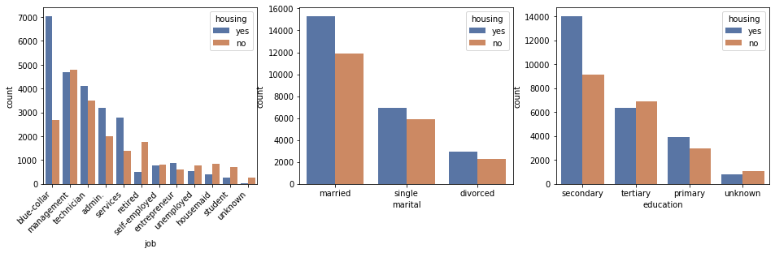


```python
plt.figure(figsize=[16,4])
plt.subplot(1,3,1)
sns.countplot(x='contact', hue='housing', data=dataset,palette="deep", order = dataset['contact'].value_counts().index)
plt.subplot(1,3,2)
sns.countplot(x='month', hue='housing', data=dataset,palette="deep", order = dataset['month'].value_counts().index)
plt.subplot(1,3,3)
sns.countplot(x='poutcome', hue='housing', data=dataset,palette="deep", order = dataset['poutcome'].value_counts().index)
plt.show()
```


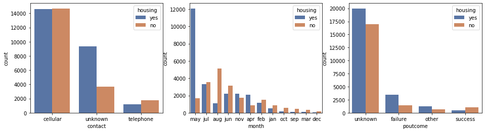


```python
plt.figure(figsize=[16,4])
plt.subplot(1,3,1)
sns.countplot(x='default', hue='housing', data=dataset,palette="deep", order = dataset['default'].value_counts().index)
plt.subplot(1,3,2)
sns.countplot(x='y', hue='housing', data=dataset,palette="deep", order = dataset['y'].value_counts().index)
plt.subplot(1,3,3)
sns.countplot(x='loan', hue='housing', data=dataset,palette="deep", order = dataset['loan'].value_counts().index)
plt.show()
```


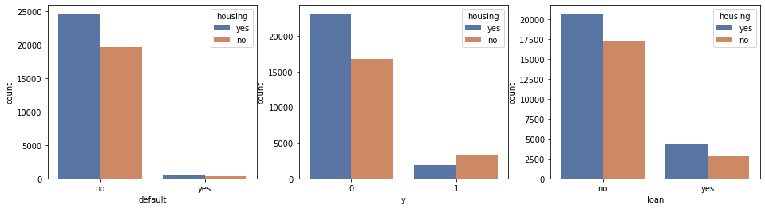


```python
colunas_categoricas =list(set(dataset.columns) - set(dataset._get_numeric_data().columns))
le = LabelEncoder()
dataset['housing'] = le.fit_transform(dataset['housing'])
```


```python
le_mapping = dict(zip(le.classes_, le.transform(le.classes_)))
print("Mapeamento de classes: {}".format(le_mapping))
```

    Mapeamento de classes: {'no': 0, 'yes': 1}


```python
for coluna in dataset[colunas_categoricas]:
    sns.barplot(dataset['housing'], dataset[coluna])
    plt.show()
dataset['housing'] = le.inverse_transform(dataset['housing'])
```


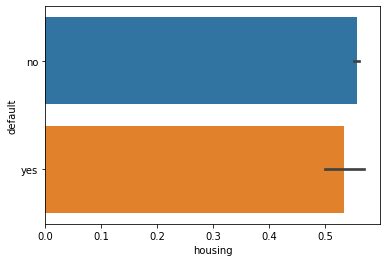


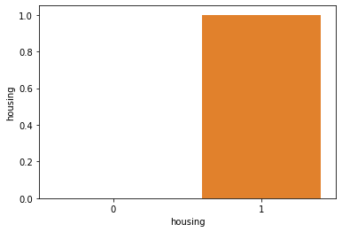


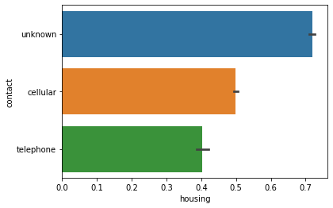


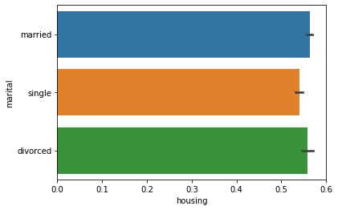


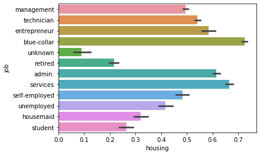


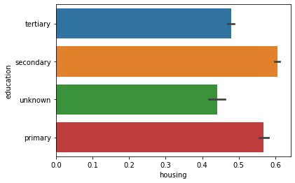


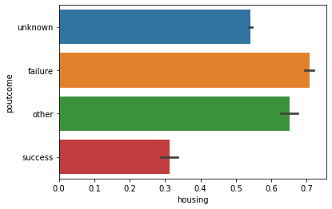


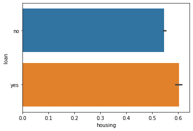


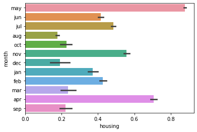


#### Resposta
As features que possuem grande representatividade são ocupação (***job***), resultado da campanha anterior (***poutcome***) e campanha atual (***y***) e crédito por padrão (***default***)


- Ocupação (***job***):
    - ***blue-collar***, ***services***, ***admin*** são as ocupações com a maior representatividade com empréstimo imobiliário.
    - Como existe um desbalanceamento na quantidade de clientes por ocupação. Visualizando a quantidade máxima de representantes por ocupação ao invés da representatividade:
        - ***blue-collar***, ***management***, ***technician***

- Campanha anterior (***poutcome***) e campanha atual (***y***):
    - A maior parte dos clientes que possuem empréstimo imobiliário não assinaram um contrato à prazo na campanha anterior e nem na campanha atual.
    - Aparentemente, os clientes que possuem empréstimo imobiliário estão em outro momento de vida, comparado aos clientes que assinaram contrato à prazo.
    - Não focar nos clientes que possuem empréstimo imobiliário é uma opção.

- Tem crédito por padrão (***default***):
    - Grande maioria dos clientes que realizaram empréstimo imobiliário não tem crédio por padrão. O que faz muito sentido, pois se o cliente tem crédito por padrão, talvez não necessite realizar um empréstimo imobiliário para comprar um imóvel.
